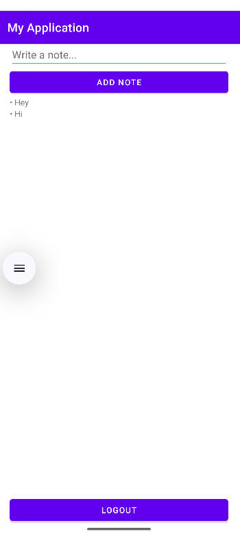

📝 Firebase Notes App (Kotlin)

A simple Notes app built with Android Studio (Kotlin) using Firebase Authentication (email + password) and Firestore for storing notes.

Each user can:

Create an account & log in

Add personal notes stored in Firestore

View only their own notes

Log out

This project demonstrates working with Firebase, Android Studio, and GitHub collaboration.

🚀 Features

Firebase Authentication → Email/password signup & login

Firestore Database → Store user-specific notes under UID

Secure Access → Each user sees only their notes

GitHub Workflow → Repo, commits, pull/push

## 📸 Screenshots

### Login Screen

### Notes Screen

🛠️ Setup Instructions
1. Clone Repo
git clone https://github.com/your-username/firebase-notes-app.git
cd firebase-notes-app

2. Open in Android Studio

Open the project in Android Studio (Kotlin)

Sync Gradle

3. Firebase Setup

Go to Firebase Console
 → Create Project

Add your Android App with the package name (from app/build.gradle)

Add SHA-1 and SHA-256 keys

./gradlew signingReport

Download google-services.json → place inside /app

4. Enable Services

Authentication → Sign-in method → Enable Email/Password

Firestore Database → Start in test mode (for development)

5. Build & Run

Run app on device (recommended over emulator for Firebase)

Create account → Log in → Add notes → Check Firestore

📂 Project Structure
app/src/main/java/com/example/notesapp/
 ├── LoginActivity.kt     # Handles login/signup
 ├── NotesActivity.kt     # Add & display notes
 ├── Note.kt              # Data class for notes
res/layout/
 ├── activity_login.xml   # Login UI
 ├── activity_notes.xml   # Notes UI

🔗 Firebase Integration

Authentication (signup & login):

auth.createUserWithEmailAndPassword(email, pass)
auth.signInWithEmailAndPassword(email, pass)

Firestore (save note under user UID):

db.collection("users").document(uid)
   .collection("notes")
   .add(Note(text))

Firestore structure:

users
 └── <uid>
      └── notes
          ├── note1
          ├── note2
